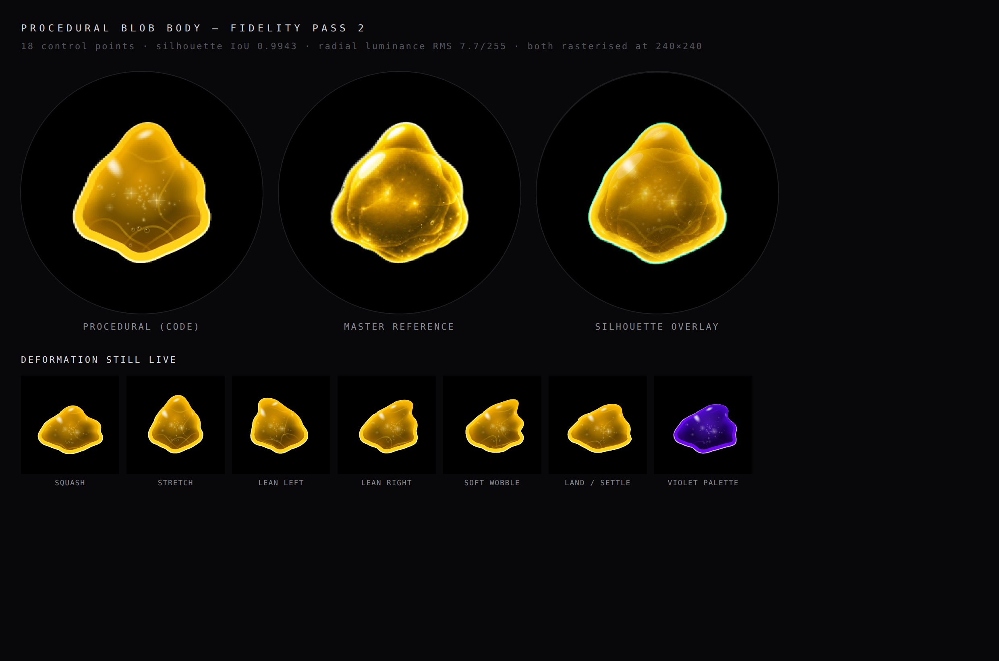

# Procedural Blob body — R&D experiment

**Status: experiment only. Nothing here is imported by the production rig,
HOME, or any state view. Do not merge into production without approval.**

Route: `/lab/procedural-blob` (deliberately unlinked from the simulator).

## Why Canvas 2D

SVG was the alternative. Canvas 2D won on three counts:

- The rig already renders through canvas (`components/blob/BlobCharacter.tsx`,
  `components/blob/downscale.ts`), so this drops into the same pipeline and the
  same supersample-then-resolve trick that keeps 240px artwork crisp.
- The material needs ~12 clipped gradient washes plus 22 nested shell fills per
  frame. In SVG each of those is a live DOM node the browser must re-layout and
  re-composite when the path data changes every frame; in canvas it is a fill.
- Canvas keeps the model portable. Everything here is paths, linear/radial
  ramps and alpha blends — the operations an ESP32-class 2D blitter can be made
  to approximate. An SVG version would have been harder to translate.

WebGL was not needed and would have been the wrong signal for the target.

## Shape

`blobShape.ts` — **18 anchor points**, closed Catmull-Rom converted to cubic
Beziers, each anchor carrying its own tension.

The neutral table is fitted, not guessed. The master body
(`public/blob/rig/yellow/body.png`) was traced radially from its bounding-box
centre; anchors were placed on the extrema of that trace and on its
highest-curvature points, with the widest remaining arcs split so no stretch
of the outline is left unsupported; then angle, radius and tension were
optimised against the trace under an ordering constraint.

Fit quality against the master, measured at the authored 240px size:

| metric | 10 anchors | 18 anchors |
| --- | --- | --- |
| silhouette IoU | 0.988 | **0.9943** |
| worst-case outline error | 2.6 px | **0.8 px** |
| radial luminance RMS | 8.8 / 255 | **7.7 / 255** |
| mean colour error inside the silhouette | ~22 / 255 | ~23 / 255 |

All of the ten-anchor error was on the right flank around 95-98 degrees, where
one Bezier span had to cover both the mid-right lobe and the cleft below it
and cut the corner off both. The extra anchors go where the master has real
structure: a dome each side of the crown instead of an apex, a lobe / cleft /
lobe run down each flank, and a fold either side of the bottom sag.

Parameters: `scale`, `scaleX`, `scaleY`, `rotation`, `lean`, `topHeight`,
`leftBulge`, `rightBulge`, `lowerLeftBulge`, `lowerRightBulge`, `bottomSag`,
`squash`, `stretch`, `centerShiftX`, `centerShiftY`, `wobbleAmount`.

Deformation is local, not a uniform transform. Each parameter is declared as
a lobe on the outline — a centre angle and an angular half-width — which
resolves to smooth per-anchor weights; naming eighteen anchors individually
would be a table nobody could retune.

**Volume preservation.** A bare lobe pushes the outline out with nothing
pulling it back, which grew a wedge. Every radial parameter now carries a
wide counter-lobe on the opposite side, and its coefficient is solved
numerically at module load so the parameter's first-order area change over
the whole outline is zero: bulge one side and the other gently compresses,
the way jelly actually behaves.

`lean` was a shear, which slides the top sideways while vertical spans stay
vertical — the other source of the wedge. It is now an arc bend about a pivot
below the body, rotating each point by an amount that grows with its height,
so local widths survive and the body curves instead of skewing.

## Deformation model

`blobPhysics.ts` — one damped spring per parameter, integrated semi-implicitly
with sub-stepping, plus a per-parameter start delay. No mesh, no solver: a few
dozen multiply-adds per frame, and it ports to fixed point.

Damping sits just under critical, so poses overshoot slightly and settle. The
staging the behaviour system will eventually want — eyes react, body follows,
jelly settles last — is expressed as increasing lag and decreasing stiffness
down the parameter list: gross pose first, volume next, lobe bulges and ripple
last, so the jelly is still moving after the pose has arrived.

## Material layers

1. Shell — translucent gel, darkening toward the base.
2. Depth shading — 22 nested copies of the silhouette carrying a measured
   luminance curve. A radial gradient gets the curve right but the wrong
   shape; nested silhouettes keep the bright shell band a constant distance
   inside the outline all the way round, and deform with the body.
3. Internal illumination — warm light suspended in the core. It goes down
   *before* the volume layers, not after: the masses float in front of the
   light, and a wash laid over them flattens every fold edge back out.
4. Volume layers — seven named masses: a broad dark core, the large front
   shell, an upper cap, a lower-left / lower-centre / lower-right fold, and a
   right-flank reflection. Each is a sub-blob of the live silhouette, clipped
   to itself and filled with a gradient that reaches zero before its own
   contour, so it reads as a body of gel rather than a drawn shape. Each also
   names the direction of the contour arc that actually shows: a mass offset
   upward has its readable edge along its *underside*, and the folds are
   pushed far enough off the body that only a shallow cap of each crosses it,
   which is what puts their edges out in the outer third running parallel to
   the outline instead of wiring across a clean core.
5. Particles — 52 sparks and 6 bubbles, deterministic (seeded PRNG, generated
   once at module load, never regenerated per frame).
6. Star flares — three four-point flares.
7. Specular — five soft elliptical highlights at graded strengths, so there is
   no single artificial hotspot: the large upper-left shoulder specular, the
   smaller crown highlight, the right-flank reflection and two faint catches.
8. Rim — walked as 32 short arcs of the surface ring, each carrying its own
   intensity from a measured angular profile, with a one-step overlap so there
   are no seams. Intensity drives width as well as alpha, so the edge is a hot
   band along the lower perimeter and the side lobes and barely a thread
   across the crown. All of it is stroked inside the clip, so only the inner
   half survives: crisp, no halo. An evenly stroked outline is the single
   thing that most makes a coded blob read as a vector shape.

Highlights, folds, flares, bubbles and sparks are authored in (angle, depth)
around the centroid and resolved through the live surface ring, so every one of
them deforms with the body instead of sliding over it.

Two palettes: `amber` (the supplied master) and `violet` (the production
Blob's colour, sampled from `public/blob/rig/body.png`).

## Cost

~9.6 ms per frame in Chromium at 2x supersample, measured on the lab page —
comfortably inside a 60 fps budget. Per frame: one 480x480 buffer, ~22 depth
shells, 7 volume layers, 64 rim arcs, ~20 gradient objects, one halving
drawImage to the 240x240 output. Deterministic detail is cached; nothing is allocated per
frame beyond the gradients.

## What still differs from the master

**Silhouette** — essentially closed. The worst remaining error is 0.8px at
240, on the shallow concavity between the lower-right lobe and the bottom-right
fold, where the fitted curve rides marginally proud of the master's edge.

**Material** — the largest remaining gap is internal texture. The master's
core carries fine painted filaments and wispy striations that are artwork, not
structure; the procedural core is clean between its sparks. Second to that,
the master's fold edges are hand-drawn and irregular in width along their run,
where the seven sub-blob contours here stay smooth and even.

## ESP32 limitations

- The 22-shell depth stack is the expensive part. On a framebuffer part it
  should become a precomputed depth LUT sampled per pixel, or a coarser stack.
- No `createRadialGradient` on embedded 2D libraries; ramps become small LUTs.
- Supersampling a 480x480 buffer needs ~900 KB at RGB565. Either render at 240
  with an edge-only AA pass, or supersample the silhouette alone.
- Float springs should become Q16.16 fixed point; the model is already scalar
  and small enough for that.
